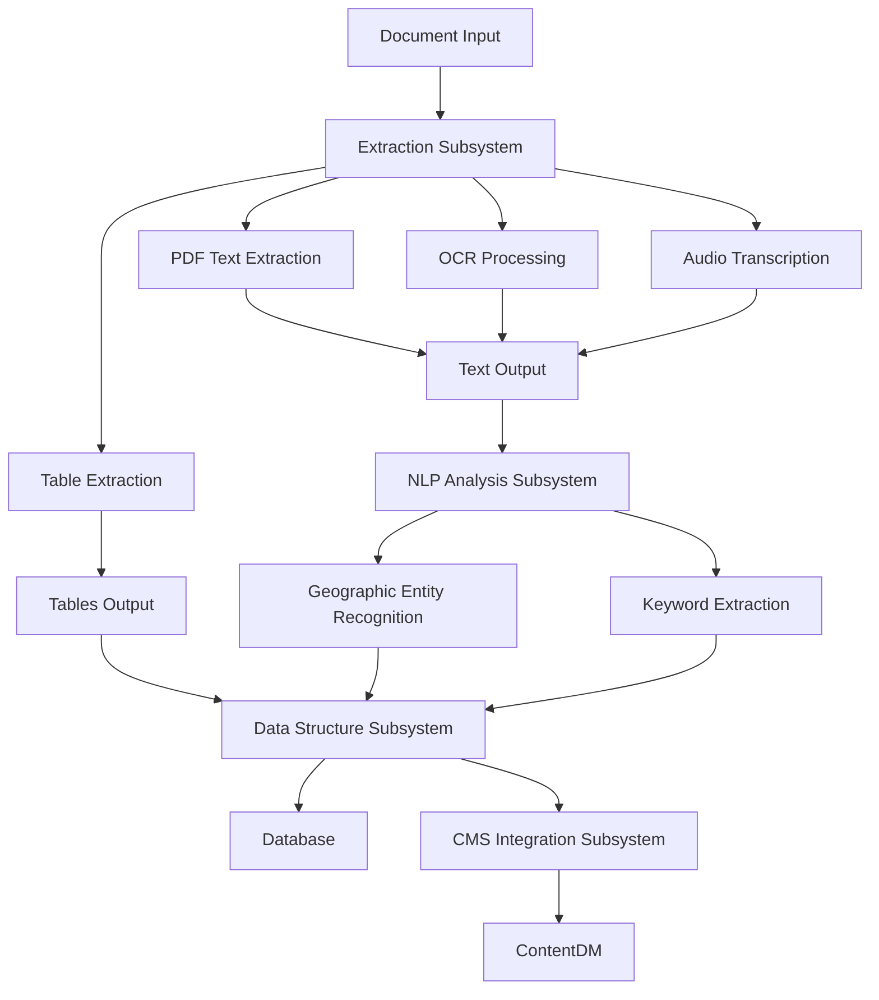
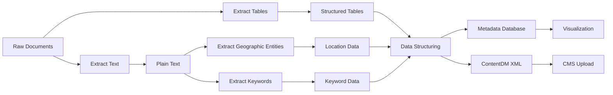
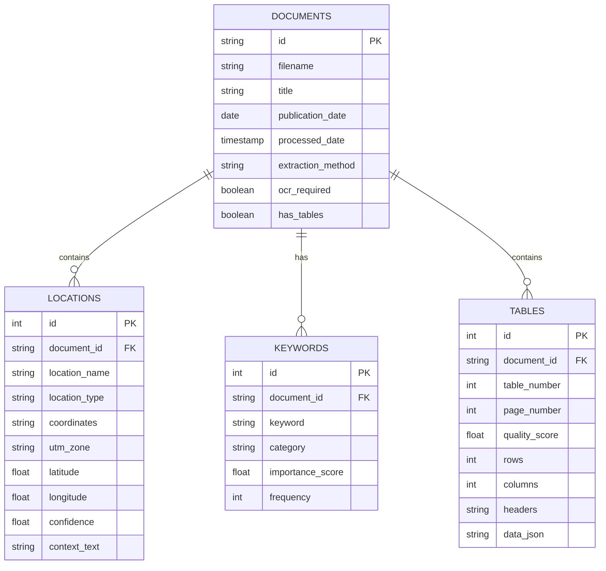
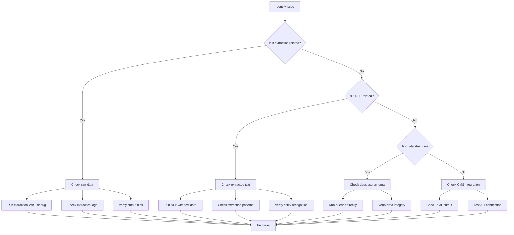
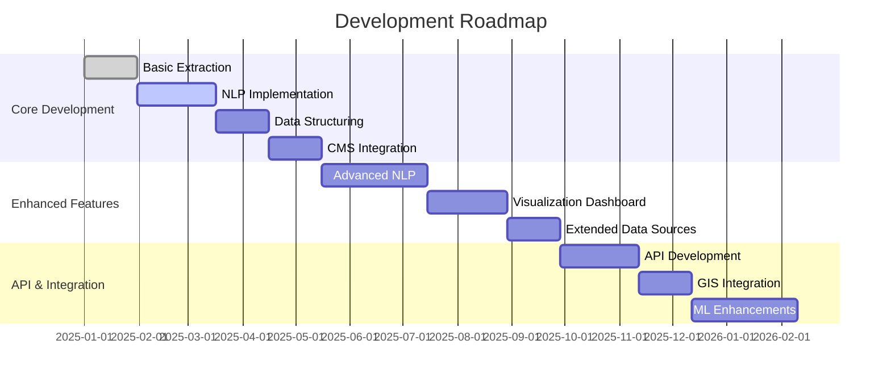

# Development Guide for EcoLogical Extractor

This document provides technical guidance for developers working on the EcoLogical Extractor project, including architecture details, component interactions, and development principles.

> **Note:** For practical contribution guidelines, coding standards, and workflow instructions, please refer to [CONTRIBUTING.md](CONTRIBUTING.md). This document focuses on technical architecture and design considerations.

## Table of Contents

- [Architecture Overview](#architecture-overview)
- [Component Interactions](#component-interactions)
- [Key Design Decisions](#key-design-decisions)
- [Development Principles](#development-principles)
- [Debugging Tips](#debugging-tips)
- [Performance Considerations](#performance-considerations)
- [Development Workflow](#development-workflow)
- [Security Considerations](#security-considerations)
- [Data Processing Pipeline](#data-processing-pipeline)
- [Future Development](#future-development)

## Architecture Overview

EcoLogical Extractor follows a layered architecture pattern with clear separation of concerns. The system consists of four main subsystems:

1. **Extraction Subsystem**: Handles document ingestion and text extraction
2. **NLP Analysis Subsystem**: Processes extracted text to identify key information
3. **Data Structure Subsystem**: Organizes extracted information into standardized formats
4. **CMS Integration Subsystem**: Enables integration with the ContentDM system

### System Architecture Diagram

```
┌─────────────────────────────────────────────────────────────────┐
│                      User Interface Layer                        │
│                                                                 │
│  ┌─────────────┐  ┌──────────────────┐  ┌────────────────────┐  │
│  │ CLI Interface│  │ Flask API (Future)│  │ Visualization Tools│  │
│  └─────────────┘  └──────────────────┘  └────────────────────┘  │
└───────────────────────────────┬─────────────────────────────────┘
                                │
┌───────────────────────────────▼─────────────────────────────────┐
│                    Processing Pipeline Layer                     │
│                                                                 │
│  ┌─────────────┐  ┌──────────────┐  ┌───────────────┐  ┌──────┐ │
│  │ Extraction  │  │ NLP Analysis │  │ Data Structure│  │ CMS  │ │
│  │ Subsystem   │◄─┼►Subsystem    │◄─┼►Subsystem     │◄─┼►Integ.│ │
│  └─────────────┘  └──────────────┘  └───────────────┘  └──────┘ │
└───────────────────────────────┬─────────────────────────────────┘
                                │
┌───────────────────────────────▼─────────────────────────────────┐
│                       Data Storage Layer                         │
│                                                                 │
│  ┌─────────────┐  ┌──────────────┐  ┌───────────────┐           │
│  │ Raw Data    │  │ Processed    │  │ Structured    │           │
│  │ Repository  │  │ Text Storage │  │ Metadata DB   │           │
│  └─────────────┘  └──────────────┘  └───────────────┘           │
└─────────────────────────────────────────────────────────────────┘
```

### Detailed Component Structure



## Data Processing Pipeline

The following diagram illustrates the data flow through the system, from raw document input to ContentDM metadata integration:



## Component Interactions

### Extraction Subsystem Components

- **PDF Text Extraction (`pdf_processing.py`, `pdf_text_extraction.py`)**
  - Extracts text from digital PDFs
  - Uses PyMuPDF (fitz) for efficient text extraction
  - Handles document structure preservation
  - Outputs text to `data/text_output/`

- **OCR Processing (`ocr_processing.py`)**
  - Extracts text from scanned/image-based PDFs
  - Uses Tesseract OCR with OpenCV preprocessing
  - Includes image enhancement for improved accuracy
  - Outputs text to `data/ocr_output/`

- **Table Extraction (`table_extraction.py`)**
  - Identifies and extracts tabular data from PDFs
  - Uses primary extraction via pdfplumber with fallback to Camelot
  - Implements Table Quality Score (TQS) to filter meaningful tables
  - Outputs tables to `data/tables/csv/` and `data/tables/json/`

- **Audio Transcription (`mp3transcriber.py`)**
  - Converts audio content to text
  - Uses OpenAI Whisper for transcription
  - Outputs transcripts to `data/text_output/`

### Component Interface Example

Here's an example of the interface between Extraction and NLP components:

```python
# Example data passed from extraction to NLP components
{
    "document_id": "ERI_2019_001",
    "document_type": "pdf_text",
    "content": "This study examines ponderosa pine restoration in Fort Valley...",
    "metadata": {
        "filename": "restoration_study_2019.pdf",
        "extraction_date": "2025-03-15T10:30:45",
        "page_count": 12,
        "extraction_method": "pymupdf",
        "confidence_score": 0.95
    },
    "pages": [
        {
            "page_number": 1,
            "content": "Title: Ecological Restoration of Ponderosa Pine...",
            "tables": []
        },
        {
            "page_number": 2,
            "content": "Abstract: This study presents findings from...",
            "tables": [1]
        }
    ],
    "tables": [
        {
            "table_id": 1,
            "page_number": 2,
            "rows": 4,
            "columns": 3,
            "headers": ["Site", "Treatment", "Results"],
            "data": [
                ["Fort Valley", "Thinning", "Positive"],
                ["Mount Trumbull", "Control", "Neutral"],
                ["Woolsey", "Thinning + Burning", "Positive"]
            ],
            "quality_score": 0.85
        }
    ]
}
```

### NLP Analysis Subsystem Components

- **Geographic Entity Recognition (`nlp_extraction.py`)**
  - Identifies location information in text
  - Implements regex patterns for coordinate extraction
  - Uses spaCy for named entity recognition
  - Detects the 16 key research sites specified in requirements

- **Keyword Extraction (`nlp_extraction.py`)**
  - Identifies domain-specific keywords and concepts
  - Uses FastText embeddings for semantic understanding
  - Applies TF-IDF analysis for term significance
  - Integrates forestry/ecological domain knowledge

### Data Structure Subsystem Components

- **Data Transformation (`data_structuring.py`)**
  - Converts extracted data to standardized formats
  - Implements JSON/XML schema for ContentDM
  - Handles data cleaning and normalization
  - Manages cross-reference resolution

- **Database Management (`data_structuring.py`)**
  - Stores and retrieves structured metadata
  - Uses SQLite for persistent storage
  - Implements DuckDB for high-performance analytical queries
  - Handles schema migration and versioning

### Database Schema Diagram



### CMS Integration Subsystem Components

- **XML Generation (`cms_integration.py`)**
  - Creates ContentDM-compatible XML metadata
  - Manages attribute mapping and validation
  - Supports batch processing

- **API Integration (`cms_integration.py`)**
  - Interfaces with ContentDM API
  - Handles authentication and session management
  - Implements error handling and retry logic

### Visualization Components

- **Geographic Visualization (`visualization.py`)**
  - Generates interactive maps of research sites
  - Uses GeoPandas for spatial data processing
  - Implements Folium for interactive web maps

- **Analytics Visualization (`visualization.py`)**
  - Creates insightful visualizations of extracted data
  - Uses Plotly for interactive charts
  - Implements keyword trend analysis and research site distribution

## Key Design Decisions

### 1. Modular Pipeline Architecture

The system uses a pipeline architecture with clear interfaces between components. This allows:

- Independent development of components
- Flexibility to replace or enhance specific modules
- Testing of components in isolation
- Parallel processing capabilities

### 2. Quality-First Extraction

The system implements quality assessment at each extraction stage:

- Table Quality Score (TQS) for filtering meaningful tables
- OCR confidence scoring
- NLP entity recognition confidence thresholds

### 3. Hybrid Approach to Location Extraction

Geographic entity recognition uses a dual approach:

- Regex patterns for formatted coordinates (UTM, lat/long)
- Named entity recognition for research sites and place names
This provides both precision (regex) and flexibility (NER).

### 4. Stateless Processing with Persistent Storage

Components are designed to be stateless, with results persisted to files or database:

- Each component can be run independently
- Processing can be resumed after interruption
- Results can be inspected at each stage

### 5. Schema-First Data Storage

The database schema is designed upfront to ensure consistent data structure:

- Clear entity relationships
- Type validation
- Support for ContentDM metadata requirements

## Development Principles

### 1. Separation of Concerns

Each module has a clearly defined responsibility:

- Extraction modules focus only on getting content from documents
- NLP modules focus only on analyzing text
- Storage modules focus only on organizing and persisting data

### 2. Progressive Enhancement

The system is designed to work with minimal functionality first and add capabilities progressively:

- Basic extraction works without NLP
- NLP works without visualization
- Each component delivers value independently

### 3. Test-Driven Development

Components should be developed with tests first:

- Define clear expected outputs
- Create tests before implementation
- Refactor with confidence

### 4. Documentation-Driven API Design

Interfaces between components are documented before implementation:

- Clear contracts for data exchange
- Explicit type annotations
- Comprehensive docstrings

### 5. Fail Fast and Explicitly

Components should validate inputs early and provide clear error messages:

- Validate parameters at function entry points
- Provide meaningful error messages
- Log detailed information for debugging

## Debugging Tips

### 1. Component-Level Testing

Test individual components in isolation:

```bash
# Test PDF extraction on a single file
python -c "from src.pdf_text_extraction import extract_text_from_pdf; print(extract_text_from_pdf('path/to/test.pdf'))"

# Test OCR processing with debug output
python src/ocr_processing.py --debug
```

### 2. Logging System

Use the built-in logging system for debugging:

```python
import logging
logger = logging.getLogger(__name__)

# Set debug level for more verbose output
logging.basicConfig(level=logging.DEBUG)

# Log debug information
logger.debug("Processing file: %s", filename)
```

### 3. Inspecting Intermediate Files

Check intermediate files in the data directories:

- `data/text_output/` contains extracted text
- `data/ocr_output/` contains OCR results
- `data/tables/json/` contains extracted tables

### Debugging Workflow Diagram



### 4. Common Issues and Solutions

**Issue**: OCR not working correctly

- Check Tesseract installation with `tesseract --version`
- Verify path is set correctly
- Try explicit path setting:

  ```python
  import pytesseract
  pytesseract.pytesseract.tesseract_cmd = r'C:\Program Files\Tesseract-OCR\tesseract.exe'
  ```

**Issue**: Table extraction not finding tables

- Try different extraction methods:

  ```bash
  python src/table_extraction.py --force
  ```

- Inspect PDF structure manually:

  ```python
  import pdfplumber
  with pdfplumber.open("document.pdf") as pdf:
      print(pdf.pages[0].find_tables())
  ```

**Issue**: NLP not identifying locations

- Check text preprocessing:

  ```python
  from src.nlp_extraction import preprocess_text
  print(preprocess_text("Sample text with Fort Valley location"))
  ```

- Examine regex patterns:

  ```python
  import re
  pattern = r'\b(\d{1,2}[A-Z])\s+(\d{6,7}[E])\s+(\d{7}[N])\b'
  print(re.findall(pattern, "Sample with 12S 429500E 3897400N coordinates"))
  ```

**Issue**: Database operations failing

- Check connection:

  ```python
  import sqlite3
  conn = sqlite3.connect('data/metadata.db')
  print(conn.execute("SELECT name FROM sqlite_master WHERE type='table'").fetchall())
  ```

- Verify schema:

  ```python
  conn = sqlite3.connect('data/metadata.db')
  print(conn.execute("PRAGMA table_info(documents)").fetchall())
  ```

## Performance Considerations

### 1. Memory Management

PDFs and NLP models can consume significant memory:

- Process documents sequentially for low memory usage
- Implement batching for large collections
- Use generators for streaming large datasets
- Consider PyPy for memory-intensive operations

### Memory Profile Graph

```mermaid
gantt
    title Memory Usage Profile by Component
    dateFormat X
    axisFormat %s
    
    section Document Loading
    PDF Loading        :a1, 0, 20s
    OCR Processing     :a2, after a1, 180s
    
    section Text Processing
    NLP Model Loading  :b1, after a2, 40s
    Entity Recognition :b2, after b1, 100s
    Keyword Extraction :b3, after b2, 80s
    
    section Data Storage
    Database Operations:c1, after b3, 30s
    XML Generation     :c2, after c1, 20s
```



### 2. Parallel Processing

For batch operations, implement parallel processing:

```python
from concurrent.futures import ProcessPoolExecutor
import os

def process_documents_parallel(document_paths, max_workers=None):
    """Process multiple documents in parallel."""
    if max_workers is None:
        max_workers = os.cpu_count() - 1 or 1
        
    with ProcessPoolExecutor(max_workers=max_workers) as executor:
        results = list(executor.map(process_document, document_paths))
    
    return results
```

### 3. Caching Strategies

Implement caching for expensive operations:

- Cache NLP model results
- Store intermediate processing results
- Reuse extraction results when possible

Example caching implementation:

```python
import functools
import pickle
import os

def disk_cache(cache_dir):
    """Decorator to cache function results to disk."""
    os.makedirs(cache_dir, exist_ok=True)
    
    def decorator(func):
        @functools.wraps(func)
        def wrapper(*args, **kwargs):
            # Create a cache key from function args
            key = pickle.dumps((func.__name__, args, kwargs))
            import hashlib
            cache_file = os.path.join(
                cache_dir, 
                hashlib.md5(key).hexdigest() + '.pkl'
            )
            
            # If cache file exists, return cached result
            if os.path.exists(cache_file):
                with open(cache_file, 'rb') as f:
                    return pickle.load(f)
            
            # Otherwise, compute result and cache it
            result = func(*args, **kwargs)
            with open(cache_file, 'wb') as f:
                pickle.dump(result, f)
            
            return result
        return wrapper
    return decorator

# Usage
@disk_cache('data/cache/nlp')
def analyze_text(text):
    # Expensive NLP operations
    return result
```

### 4. Data Storage Optimization

Optimize database operations:

- Use indexes for frequently queried fields
- Implement batch inserts for bulk data
- Consider denormalization for query performance

Example database optimization:

```python
# Batch insert example
def batch_insert_locations(locations, conn, batch_size=1000):
    """Insert locations in batches for better performance."""
    cursor = conn.cursor()
    
    # Create chunks of locations
    for i in range(0, len(locations), batch_size):
        batch = locations[i:i+batch_size]
        
        # Prepare parameters for batch insert
        params = [
            (
                loc['document_id'],
                loc['location_name'],
                loc['location_type'],
                loc['coordinates'],
                loc['utm_zone'],
                loc['latitude'],
                loc['longitude'],
                loc['confidence'],
                loc['context_text']
            )
            for loc in batch
        ]
        
        # Execute batch insert
        cursor.executemany(
            """
            INSERT INTO locations (
                document_id, location_name, location_type, coordinates,
                utm_zone, latitude, longitude, confidence, context_text
            ) VALUES (?, ?, ?, ?, ?, ?, ?, ?, ?)
            """,
            params
        )
    
    conn.commit()
```

## Security Considerations

### 1. Input Validation

Always validate input data, especially when processing external files:

```python
def extract_text_from_pdf(pdf_path):
    """Extract text from a PDF file."""
    # Validate input
    if not pdf_path or not isinstance(pdf_path, str):
        raise ValueError("PDF path must be a non-empty string")
    
    if not os.path.exists(pdf_path):
        raise FileNotFoundError(f"PDF file not found: {pdf_path}")
    
    # Validate file type
    if not pdf_path.lower().endswith('.pdf'):
        raise ValueError(f"File is not a PDF: {pdf_path}")
    
    # Extraction logic...
```

### 2. Path Traversal Prevention

Prevent path traversal attacks:

```python
import os
from pathlib import Path

def safe_join_paths(base_dir, user_path):
    """Safely join paths to prevent path traversal."""
    # Normalize paths
    base_path = Path(base_dir).resolve()
    joined_path = Path(base_dir, user_path).resolve()
    
    # Ensure the joined path is within the base directory
    if not str(joined_path).startswith(str(base_path)):
        raise ValueError(f"Path traversal detected: {user_path}")
    
    return joined_path
```

### 3. ContentDM API Security

Secure API interactions:

```python
def create_contentdm_api_client(api_base_url, api_key=None):
    """Create a secure ContentDM API client."""
    # Use environment variables for sensitive data
    if api_key is None:
        api_key = os.environ.get('CONTENTDM_API_KEY')
        if not api_key:
            raise ValueError("API key required for ContentDM integration")
    
    # Use HTTPS for all API communication
    if not api_base_url.startswith('https://'):
        raise ValueError("ContentDM API URL must use HTTPS")
    
    # Configure session with security headers
    session = requests.Session()
    session.headers.update({
        'X-API-Key': api_key,
        'User-Agent': 'EcoLogical-Extractor/1.0',
    })
    
    return ContentDMClient(api_base_url, session)
```

### 4. Data Sanitization

Sanitize data before storage or display:

```python
import re
import html

def sanitize_text_for_storage(text):
    """Sanitize text before storage."""
    if not text:
        return ""
    
    # Remove potentially dangerous control characters
    text = re.sub(r'[\x00-\x08\x0B\x0C\x0E-\x1F\x7F]', '', text)
    
    return text

def sanitize_text_for_xml(text):
    """Sanitize text for XML output."""
    if not text:
        return ""
    
    # Escape XML entities
    return html.escape(text)
```

## Future Development

### 1. Planned Enhancements

1. **Enhanced NLP capabilities**:
   - Topic modeling for document classification
   - Relationship extraction between entities
   - Semantic similarity for document clustering

2. **Improved visualization**:
   - Interactive dashboard for data exploration
   - Temporal analysis of research trends
   - Geographic distribution heat maps

3. **Extended data source support**:
   - Additional document formats (DOCX, HTML)
   - Web scraping for related research
   - Dataset integration

### 2. Integration Opportunities

1. **GIS integration**:
   - Connect with external GIS systems
   - Export data to common GIS formats
   - Implement more advanced spatial analysis

2. **Machine learning enhancements**:
   - Document classification
   - Automatic keyword suggestion
   - PDF structure recognition

3. **API development**:
   - RESTful API for external system integration
   - GraphQL API for flexible data queries
   - Webhook support for event-driven workflows

### Development Roadmap



### 3. Scalability Considerations

As the system grows, consider these scalability approaches:

1. **Distributed processing**:
   - Implement message queue for task distribution
   - Deploy workers on multiple machines
   - Use container orchestration for scaling

2. **Database scaling**:
   - Migrate to a more scalable database
   - Implement sharding for large datasets
   - Consider NoSQL options for specific use cases

3. **Cloud deployment**:
   - Containerize components for cloud deployment
   - Use serverless functions for event-driven processing
   - Implement auto-scaling based on workload

---

This document is a living guide. If you find anything unclear or have suggestions for improvements, please submit an issue or PR.
